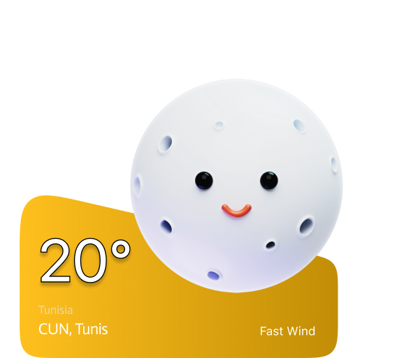

# HIKI Project Refactoring & Migration Plan

**Project**: Web-based Hiking & Camping Companion  
**Current Status**: Pre-alpha with inconsistent multi-developer structure  
**Execution Date**: [TO BE SCHEDULED]  
**Migration Type**: Non-destructive (original files backed up before each phase)

---

## EXECUTIVE SUMMARY

This plan standardizes your project structure from a fragmented, multi-developer layout into a clean, maintainable architecture. The migration is sequenced to **minimize breakage** by updating references incrementally before moving files.

### Key Improvements:

✅ Unified API endpoint strategy (`/api/` only)  
✅ Eliminated HTML/PHP duplication (PHP-only for dynamic content)  
✅ Standardized folder naming (no special characters like `&`)  
✅ Organized JavaScript to match page structure  
✅ PSR-4 style class organization  
✅ All references updated before file movement

---

## PART 1: DEFINITIVE NEW DIRECTORY TREE

```
projet-web-gl21-chabiba/
│
├── api/                              # ← ALL backend JSON endpoints consolidated here
│   ├── getTrails.php                 # From current /api/getTrails.php
│   ├── weather.php                   # NEW (aggregated weather endpoints)
│   ├── booking.php                   # From /pages/search-engine/api/book.php
│   ├── sites.php                     # From /pages/search-engine/api/sites.php
│   ├── posts.php                     # NEW (lost & found endpoints)
│   └── search.php                    # From /pages/search-engine/api/search.php (or /api/search/)
│
├── assets/
│   ├── Fonts/                        # (existing)
│   └── Images/                       # (existing, rename from uppercase if possible)
│
├── src/                              # ← New container for backend code
│   ├── Classes/
│   │   ├── Repository.php            # Base class
│   │   ├── Irepository.php           # Interface
│   │   ├── UserRepository.php
│   │   ├── BookingRepository.php
│   │   ├── PostRepository.php
│   │   ├── AddressRepository.php    # (fix capitalization)
│   │   ├── CampingSiteRepository.php
│   │   ├── TrailRepository.php
│   │   ├── ConnexionDB.php           # ← Consider renaming to ConnectionDB.php
│   │   ├── WeatherService.php
│   │   ├── MoonService.php
│   │   └── cache/                    # Services cache folder
│   │       └── weather/
│   │           └── forecast_tunis.json
│   │
│   └── Includes/                     # ← Global layout components
│       ├── header.php                # (move from /pages/includes/)
│       ├── footer.php                # (create if needed)
│       └── booking-popup.php         # (move from /pages/includes/)
│
├── css/
│   ├── base/                         # (existing)
│   │   ├── reset.css
│   │   └── typography.css
│   ├── layout/                       # (existing)
│   │   ├── header.css
│   │   ├── footer.css
│   │   └── navigation.css
│   ├── components/                   # ← NEW (for reusable UI components)
│   │   └── booking-popup.css
│   ├── pages/                        # ← Reorganized to match page names
│   │   ├── home.css
│   │   ├── weather.css
│   │   ├── hiking-guide.css
│   │   ├── equipment.css
│   │   ├── moon.css
│   │   ├── bookings.css
│   │   ├── community.css
│   │   ├── catalogue.css
│   │   ├── lost-and-found.css        # (rename from l&f.css)
│   │   ├── search-engine.css
│   │   └── auth.css
│   ├── shared/                       # (existing)
│   │   └── hiki-page.css
│   ├── site-shell.css                # (global shell styles)
│   └── main.css                      # (if used, keep for legacy)
│
├── js/
│   ├── api/                          # API wrapper scripts
│   │   ├── astronomy.api.js
│   │   └── weather.api.js
│   ├── pages/                        # ← Page-specific JavaScript (NOW POPULATED)
│   │   ├── home.js
│   │   ├── weather.js
│   │   ├── hiking-guide.js
│   │   ├── equipment.js
│   │   ├── moon.js
│   │   ├── bookings.js
│   │   ├── community.js
│   │   ├── lost-and-found.js         # (rename from l&f.js)
│   │   ├── search-engine.js
│   │   └── auth.js
│   ├── data/                         # Data stubs/mocks
│   │   ├── equipment.data.js
│   │   └── sites.data.js
│   ├── features/                     # Reusable feature logic
│   │   ├── availability.js
│   │   ├── ratings.js
│   │   ├── recommendations.js
│   │   └── sites.js
│   ├── shared/                       # Global/common scripts
│   │   ├── main.js
│   │   └── stars-bg.js
│   └── booking.js                    # (if shared across pages, can stay here)
│
├── database/
│   ├── DB.md
│   └── init.sql
│
├── pages/                            # ← REFACTORED: Autoloader only
│   └── autoloader.php                # (moved from here, but kept for backward compat during transition)
│
├── public_html/                      # ← NEW: All user-facing routes (PHP only)
│   ├── index.php                     # (root/home page)
│   │
│   ├── weather.php
│   ├── hiking-guide.php
│   ├── equipment.php
│   ├── moon.php
│   ├── community.php
│   ├── bookings.php
│   │
│   ├── auth/
│   │   ├── login.php
│   │   ├── signup.php
│   │   ├── logout.php
│   │   ├── processLogin.php
│   │   └── processSignUp.php
│   │
│   ├── catalogue/
│   │   ├── index.php                 # (catalog listing)
│   │   ├── details.php               # (site details)
│   │   ├── book.php                  # (booking handler)
│   │   ├── gridItem.php              # (partial/component)
│   │   └── listItem.php              # (partial/component)
│   │
│   ├── lost-and-found/               # ← Rename from lost&found
│   │   ├── lost-and-found.php        # (main page)
│   │   ├── add_post.php              # (form handler)
│   │   ├── save_post.php             # (save handler)
│   │   ├── delete_post.php           # (delete handler)
│   │   └── itemlist.php              # (partial/component)
│   │
│   ├── manual/                       # Static guides
│   │   ├── fire.html
│   │   ├── hiking.html
│   │   └── tent.html
│   │
│   ├── search-engine/                # ← Legacy search handler (can be deprecated)
│   │   └── index.php
│   │
│   └── sites/                        # ← Deprecated (consolidate into /catalogue/)
│       └── [archived]
│
├── config/                           # ← NEW: Configuration files
│   └── paths.php                     # (centralized path constants)
│
├── index.php                         # (entry point redirects to public_html/index.php)
├── autoloader.php                    # (global autoloader at root for backward compat)
├── package.json
├── CONTEXT.md
├── README.md
├── REFACTORING_PLAN.md               # ← This file
├── MIGRATION_LOG.md                  # ← NEW (track progress)
└── [standard git/vscode files]
```

---

## PART 2: COMPLETE FILE MAPPING & CONSOLIDATION PLAN

### 2.1 Files to MOVE (No Changes)

| Current Path                               | New Path                                         | Notes                                   |
| ------------------------------------------ | ------------------------------------------------ | --------------------------------------- |
| `/class/Repository.php`                    | `/src/Classes/Repository.php`                    | Base repository class                   |
| `/class/Irepository.php`                   | `/src/Classes/IRepository.php`                   | Interface (fix capitalization)          |
| `/class/UserRepository.php`                | `/src/Classes/UserRepository.php`                | User data access                        |
| `/class/BookingRepository.php`             | `/src/Classes/BookingRepository.php`             | Booking data access                     |
| `/class/PostRepository.php`                | `/src/Classes/PostRepository.php`                | Lost & Found posts                      |
| `/class/AdressRepository.php`              | `/src/Classes/AddressRepository.php`             | Fix typo: Adress → Address              |
| `/class/CampingSiteRepository.php`         | `/src/Classes/CampingSiteRepository.php`         | Camping sites data                      |
| `/class/TrailRepository.php`               | `/src/Classes/TrailRepository.php`               | Trail data                              |
| `/class/ConnexionDB.php`                   | `/src/Classes/ConnexionDB.php`                   | (Keep name for now; can refactor later) |
| `/class/WeatherService.php`                | `/src/Classes/WeatherService.php`                | Weather API wrapper                     |
| `/class/MoonService.php`                   | `/src/Classes/MoonService.php`                   | Moon phase service                      |
| `/class/cache/weather/forecast_tunis.json` | `/src/Classes/cache/weather/forecast_tunis.json` | Cache data                              |
| `/pages/includes/header.php`               | `/src/Includes/header.php`                       | Main header template                    |
| `/pages/includes/booking-popup.php`        | `/src/Includes/booking-popup.php`                | Booking modal template                  |

### 2.2 Files to CONSOLIDATE (Merge HTML → PHP)

| HTML File                        | PHP File                             | Action                                           |
| -------------------------------- | ------------------------------------ | ------------------------------------------------ |
| `/pages/community.html`          | `/pages/community.php`               | **Merge HTML content into PHP as view template** |
| `/pages/equipment.html`          | `/pages/equipment.php`               | **Merge HTML content into PHP as view template** |
| `/pages/weather.html`            | `/pages/weather.php`                 | **Already has PHP; delete HTML**                 |
| `/pages/moon.html`               | `/pages/moon.php`                    | **Already has PHP; delete HTML**                 |
| `/pages/availability.html`       | `/pages/bookings.php`                | **Merge into bookings.php**                      |
| `/pages/shops.html`              | _(deprecated)_                       | **Delete (commented out in navigation)**         |
| `/pages/sites/site-details.html` | `/public_html/catalogue/details.php` | **Content already in PHP; delete HTML**          |
| `/pages/sites/sites.html`        | `/public_html/catalogue/index.php`   | **Content already in PHP; delete HTML**          |

### 2.3 Files to MOVE (Page Routes)

| Current Path                    | New Path                              | Notes                                |
| ------------------------------- | ------------------------------------- | ------------------------------------ |
| `/pages/weather.php`            | `/public_html/weather.php`            | Update require paths                 |
| `/pages/hiking-guide.php`       | `/public_html/hiking-guide.php`       | Update require paths                 |
| `/pages/equipment.php`          | `/public_html/equipment.php`          | Update require paths                 |
| `/pages/moon.php`               | `/public_html/moon.php`               | Update require paths                 |
| `/pages/community.php`          | `/public_html/community.php`          | Update require paths                 |
| `/pages/bookings.php`           | `/public_html/bookings.php`           | Update require paths                 |
| `/pages/auth/login.php`         | `/public_html/auth/login.php`         | Update require paths                 |
| `/pages/auth/signup.php`        | `/public_html/auth/signup.php`        | Update require paths                 |
| `/pages/auth/logout.php`        | `/public_html/auth/logout.php`        | Update require paths                 |
| `/pages/auth/processLogin.php`  | `/public_html/auth/processLogin.php`  | Update require paths + redirects     |
| `/pages/auth/processSignUp.php` | `/public_html/auth/processSignUp.php` | Update require paths + redirects     |
| `/pages/catalogue/`             | `/public_html/catalogue/`             | Update require paths in all files    |
| `/pages/lost&found/`            | `/public_html/lost-and-found/`        | Rename folder + update require paths |
| `/pages/manual/`                | `/public_html/manual/`                | Update require paths if any          |
| `/pages/index.php`              | `/public_html/catalogue/index.php`    | (already in subdirectory)            |

### 2.4 API Files to CONSOLIDATE

| Current Path                          | New Path                                             | Action                        |
| ------------------------------------- | ---------------------------------------------------- | ----------------------------- |
| `/api/getTrails.php`                  | `/api/getTrails.php`                                 | Keep (already in right place) |
| `/api/search/`                        | `/api/search/`                                       | Keep (already in right place) |
| `/pages/search-engine/api/book.php`   | `/api/booking.php`                                   | Move + rename for clarity     |
| `/pages/search-engine/api/search.php` | `/api/search.php` OR consolidate with `/api/search/` | Merge with existing search    |
| `/pages/search-engine/api/sites.php`  | `/api/sites.php`                                     | Move to root API              |

### 2.5 Deprecated/Remove

| Path                        | Reason                                              |
| --------------------------- | --------------------------------------------------- |
| `/pages/lost-and-found/`    | Empty folder (duplicate)                            |
| `/pages/search-engine/api/` | Files moved to `/api/`                              |
| `/pages/search-engine/`     | Can be kept as legacy or deprecated with redirect   |
| `/pages/sites/`             | Content consolidated into `/public_html/catalogue/` |

---

## PART 3: ASSET & LINK PATH MIGRATION GUIDE

### 3.1 Require/Include Path Migration Rules

#### **RULE 1: From Pages Directory**

**Old Pattern** (pages in `/pages/`):

```php
require_once __DIR__ . '/../class/WeatherService.php';
include __DIR__ . '/includes/header.php';
```

**New Pattern** (pages in `/public_html/`):

```php
require_once __DIR__ . '/../../src/Classes/WeatherService.php';
include __DIR__ . '/../../src/Includes/header.php';
```

#### **RULE 2: Subdirectory Pages (e.g., `/public_html/auth/`)**

**Old Pattern** (from `/pages/auth/`):

```php
require_once __DIR__ . '/../../class/ConnexionDB.php';
include __DIR__ . '/../includes/header.php';
```

**New Pattern** (from `/public_html/auth/`):

```php
require_once __DIR__ . '/../../../src/Classes/ConnexionDB.php';
include __DIR__ . '/../../src/Includes/header.php';
```

#### **RULE 3: For Partials in Subdirectories**

**Old Pattern** (from `/pages/catalogue/gridItem.php`):

```php
// Access from parent directory
```

**New Pattern** (from `/public_html/catalogue/gridItem.php`):

```php
// Same relative depth as before; adjust based on actual usage
```

### 3.2 Asset Path Migration

#### **Images & Fonts**

**Old Pattern** (from `/pages/weather.php`):

```php

```

**New Pattern** (from `/public_html/weather.php`):

```php

<!-- OR use root-relative path if Apache rewrite rules support it: -->

```

### 3.3 CSS Link Migration

#### **Old Pattern** (from any page in `/pages/`):

```php
$extraStyles = ['css/shared/hiki-page.css', 'css/pages/weather-page.css'];
```

**New Pattern** (from `/public_html/` pages):

```php
$extraStyles = ['/projet-web-gl21-chabiba/css/shared/hiki-page.css',
                '/projet-web-gl21-chabiba/css/pages/weather.css'];
```

**RECOMMENDATION**: Use absolute URLs in header.php to avoid depth issues:

```php
<?php foreach ($extraStyles as $style): ?>
    <link rel="stylesheet" href="/projet-web-gl21-chabiba/<?= htmlspecialchars($style) ?>" />
<?php endforeach; ?>
```

### 3.4 JavaScript Link Migration

#### **Old Pattern** (from header, assuming root is `/`):

```html
<script src="/projet-web-gl21-chabiba/js/main.js"></script>
```

**New Pattern** (stays the same):

```html
<script src="/projet-web-gl21-chabiba/js/main.js"></script>
<script src="/projet-web-gl21-chabiba/js/pages/weather.js"></script>
```

### 3.5 Navigation Link Migration

#### **Old Pattern** (hard-coded in `/pages/includes/header.php`):

```php
['key' => 'weather', 'label' => 'weather', 'href' => '/projet-web-gl21-chabiba/pages/weather.php'],
```

**New Pattern** (after moving pages):

```php
['key' => 'weather', 'label' => 'weather', 'href' => '/projet-web-gl21-chabiba/public_html/weather.php'],
```

**ALTERNATIVE** (cleaner - use a config file):

```php
// In config/paths.php
const PATHS = [
    'root' => '/projet-web-gl21-chabiba',
    'weather' => '/projet-web-gl21-chabiba/public_html/weather.php',
    'catalogue' => '/projet-web-gl21-chabiba/public_html/catalogue/index.php',
];

// In header.php
['key' => 'weather', 'label' => 'weather', 'href' => PATHS['weather']],
```

### 3.6 API Endpoint Migration

#### **Old Pattern** (from booking popup in `/pages/includes/booking-popup.php`):

```html
<form
	id="bookingForm"
	method="POST"
	action="/projet-web-gl21-chabiba/pages/catalogue/book.php"
></form>
```

**New Pattern** (after API consolidation):

```html
<form
	id="bookingForm"
	method="POST"
	action="/projet-web-gl21-chabiba/api/booking.php"
></form>
```

---

## PART 4: EXECUTION ORDER (Step-by-Step Checklist)

### **PHASE 0: PREPARATION & BACKUP** ⚠️

- [ ] **0.1** Create a full backup of the project:

  ```bash
  git checkout -b backup/pre-refactor
  git commit -m "Backup before refactoring"
  ```

  OR manually zip the entire project folder

- [ ] **0.2** Create this file: `/MIGRATION_LOG.md` to track progress

- [ ] **0.3** Test the current project:
  - [ ] All pages load in browser
  - [ ] Navigation links work
  - [ ] Auth flows work (login/signup)
  - [ ] API endpoints work
  - Record baseline state

---

### **PHASE 1: CREATE NEW DIRECTORY STRUCTURE**

_Parallel execution safe - no file edits yet_

- [ ] **1.1** Create new directories:

  ```bash
  mkdir -p src/Classes/cache/weather
  mkdir -p src/Includes
  mkdir -p public_html/auth
  mkdir -p public_html/catalogue
  mkdir -p public_html/lost-and-found
  mkdir -p public_html/manual
  mkdir -p config
  mkdir -p css/components
  mkdir -p js/pages
  ```

- [ ] **1.2** Create placeholder files:
  ```bash
  touch config/paths.php
  touch MIGRATION_LOG.md
  ```

---

### **PHASE 2: UPDATE AUTOLOADER & PATHS**

_Must be done before moving class files_

- [ ] **2.1** Create new autoloader at `/autoloader.php`:

  ```php
  <?php
  // Global autoloader for src/Classes namespace
  spl_autoload_register(function($className) {
      $file = __DIR__ . '/src/Classes/' . $className . '.php';
      if (file_exists($file)) {
          include_once $file;
      }
  });
  ```

- [ ] **2.2** Create `/config/paths.php`:

  ```php
  <?php
  define('PROJECT_ROOT', '/projet-web-gl21-chabiba');
  define('SRC_DIR', __DIR__ . '/../src');
  define('CLASSES_DIR', SRC_DIR . '/Classes');
  define('INCLUDES_DIR', SRC_DIR . '/Includes');

  // Navigation paths
  const ROUTES = [
      'home' => PROJECT_ROOT . '/public_html/index.php',
      'weather' => PROJECT_ROOT . '/public_html/weather.php',
      'hiking_guide' => PROJECT_ROOT . '/public_html/hiking-guide.php',
      'equipment' => PROJECT_ROOT . '/public_html/equipment.php',
      'moon' => PROJECT_ROOT . '/public_html/moon.php',
      'community' => PROJECT_ROOT . '/public_html/community.php',
      'catalogue' => PROJECT_ROOT . '/public_html/catalogue/index.php',
      'bookings' => PROJECT_ROOT . '/public_html/bookings.php',
      'lost_found' => PROJECT_ROOT . '/public_html/lost-and-found/lost-and-found.php',
      'login' => PROJECT_ROOT . '/public_html/auth/login.php',
      'signup' => PROJECT_ROOT . '/public_html/auth/signup.php',
      'logout' => PROJECT_ROOT . '/public_html/auth/logout.php',
  ];
  ```

- [ ] **2.3** Update `/pages/autoloader.php` (keep for backward compat, make it require root autoloader):
  ```php
  <?php
  require_once __DIR__ . '/../autoloader.php';
  ```

---

### **PHASE 3: CONSOLIDATE & UPDATE CLASS FILES**

_No file moves yet; just update requires_

- [ ] **3.1** Update `/class/ConnexionDB.php`:
  - [ ] Any require/include statements pointing to other classes → use relative paths to new structure
  - Test by temporarily running an auth flow

- [ ] **3.2** Update all Repository files (`/class/*.php`):
  - [ ] Check if any files require other repos
  - [ ] Update imports if needed
  - [ ] Example:

    ```php
    // OLD
    require_once 'ConnexionDB.php';

    // NEW (in src/Classes/UserRepository.php)
    require_once __DIR__ . '/ConnexionDB.php';
    // OR via autoloader (after moved)
    ```

---

### **PHASE 4: MOVE CLASS FILES TO `/src/Classes/`**

- [ ] **4.1** Move class files:

  ```bash
  mv class/Repository.php src/Classes/
  mv class/Irepository.php src/Classes/IRepository.php
  mv class/UserRepository.php src/Classes/
  mv class/BookingRepository.php src/Classes/
  mv class/PostRepository.php src/Classes/
  mv class/AdressRepository.php src/Classes/AddressRepository.php
  mv class/CampingSiteRepository.php src/Classes/
  mv class/TrailRepository.php src/Classes/
  mv class/ConnexionDB.php src/Classes/
  mv class/WeatherService.php src/Classes/
  mv class/MoonService.php src/Classes/
  mv class/cache/weather/forecast_tunis.json src/Classes/cache/weather/
  rmdir class/cache/weather class/cache class
  ```

- [ ] **4.2** Test that autoloader works:
  - Open any page in browser
  - Check if classes load without errors
  - If errors, update autoloader or paths

---

### **PHASE 5: MOVE INCLUDES TO `/src/Includes/`**

- [ ] **5.1** Move include files:

  ```bash
  mv pages/includes/header.php src/Includes/
  mv pages/includes/booking-popup.php src/Includes/
  rmdir pages/includes
  ```

- [ ] **5.2** Update header.php to use new autoloader:
  - At top of `/src/Includes/header.php`, add:
    ```php
    <?php
    if (!defined('PROJECT_ROOT')) {
        require_once __DIR__ . '/../../../autoloader.php';
        require_once __DIR__ . '/../../../config/paths.php';
    }
    ```

---

### **PHASE 6: CONSOLIDATE HTML → PHP PAGES**

_Before moving, merge duplicate files_

- [ ] **6.1** Merge `/pages/community.html` into `/pages/community.php`:
  - [ ] Open both files
  - [ ] Extract HTML structure from .html file
  - [ ] Paste into .php file as the output template (after PHP logic)
  - [ ] Delete .html file

- [ ] **6.2** Repeat for `/pages/equipment.html` → `/pages/equipment.php`

- [ ] **6.3** Delete `/pages/weather.html` (already has .php)

- [ ] **6.4** Delete `/pages/moon.html` (already has .php)

- [ ] **6.5** Merge `/pages/availability.html` into `/pages/bookings.php` (or just delete if redundant)

- [ ] **6.6** Delete `/pages/shops.html` (deprecated)

- [ ] **6.7** Delete `/pages/sites/` files (content in /pages/catalogue/)

---

### **PHASE 7: UPDATE ALL REQUIRE/INCLUDE PATHS IN PAGES**

_Before moving files, update all paths_

#### For each file in `/pages/` that we'll move:

**EXAMPLE: `/pages/weather.php`**

- [ ] **7.1a** Old:

  ```php
  require_once __DIR__ . '/../class/WeatherService.php';
  include __DIR__ . '/includes/header.php';
  ```

  New (before move):

  ```php
  require_once __DIR__ . '/../src/Classes/WeatherService.php';
  include __DIR__ . '/../src/Includes/header.php';
  ```

- [ ] **7.1b** Repeat this pattern for:
  - [ ] `/pages/hiking-guide.php`
  - [ ] `/pages/equipment.php`
  - [ ] `/pages/moon.php`
  - [ ] `/pages/community.php`
  - [ ] `/pages/bookings.php`
  - [ ] `/pages/auth/login.php`
  - [ ] `/pages/auth/signup.php`
  - [ ] `/pages/auth/logout.php`
  - [ ] `/pages/auth/processLogin.php`
  - [ ] `/pages/auth/processSignUp.php`
  - [ ] `/pages/catalogue/index.php`
  - [ ] `/pages/catalogue/details.php`
  - [ ] `/pages/catalogue/book.php`
  - [ ] `/pages/catalogue/gridItem.php`
  - [ ] `/pages/catalogue/listItem.php`
  - [ ] `/pages/lost&found/lost&found.php`
  - [ ] `/pages/lost&found/add_post.php`
  - [ ] `/pages/lost&found/save_post.php`
  - [ ] `/pages/lost&found/delete_post.php`
  - [ ] `/pages/lost&found/itemlist.php`

**SPECIAL CASES:**

For files in subdirectories that include the header:

Old (from `/pages/auth/login.php`):

```php
include __DIR__ . '/includes/header.php';  // ❌ WRONG - goes to /pages/includes/ which no longer exists
```

New (still in `/pages/auth/` during phase 7):

```php
include __DIR__ . '/../src/Includes/header.php';
```

---

### **PHASE 8: UPDATE NAVIGATION & LINK PATHS**

- [ ] **8.1** Update `/src/Includes/header.php`:
  - [ ] Change all href paths from `/pages/` to `/public_html/`:

    ```php
    // OLD
    ['key' => 'weather', 'label' => 'weather', 'href' => '/projet-web-gl21-chabiba/pages/weather.php'],

    // NEW
    ['key' => 'weather', 'label' => 'weather', 'href' => '/projet-web-gl21-chabiba/public_html/weather.php'],
    ```

  - [ ] Replace `lost&found` with `lost-and-found`
  - [ ] Update search-engine redirect URL

- [ ] **8.2** Update `/pages/auth/login.php` link to signup:
  - [ ] Old: `href="/projet-web-gl21-chabiba/pages/auth/signup.php"`
  - [ ] New: `href="/projet-web-gl21-chabiba/public_html/auth/signup.php"`

- [ ] **8.3** Update `/pages/bookings.php` link to catalogue:
  - [ ] Old: `href="/projet-web-gl21-chabiba/pages/catalogue/index.php"`
  - [ ] New: `href="/projet-web-gl21-chabiba/public_html/catalogue/index.php"`

- [ ] **8.4** Update all catalogue links:
  - [ ] In `/pages/catalogue/gridItem.php`: details link
  - [ ] In `/pages/catalogue/listItem.php`: details link
  - [ ] In `/pages/catalogue/details.php`: back to catalogue link
  - [ ] In `/pages/includes/booking-popup.php`: book action

---

### **PHASE 9: CONSOLIDATE & MOVE API ENDPOINTS**

- [ ] **9.1** Move existing API files:

  ```bash
  mv pages/search-engine/api/book.php api/booking.php
  mv pages/search-engine/api/sites.php api/sites.php
  # (keep /api/getTrails.php and /api/search/ as-is)
  ```

- [ ] **9.2** Update all form actions & API calls in pages:
  - [ ] In `/pages/includes/booking-popup.php`:
    - Old: `action="/projet-web-gl21-chabiba/pages/catalogue/book.php"`
    - New: `action="/projet-web-gl21-chabiba/api/booking.php"`
  - [ ] In `/pages/lost&found/add_post.php`:
    - Old: `action="save_post.php"`
    - New: `action="/projet-web-gl21-chabiba/api/posts/save.php"`
  - [ ] Update any JavaScript API calls in `/js/`

---

### **PHASE 10: MOVE PAGE FILES TO `/public_html/`**

_Now safe to move files since all paths are updated_

- [ ] **10.1** Move root-level pages:

  ```bash
  mkdir -p public_html
  mv pages/weather.php public_html/
  mv pages/hiking-guide.php public_html/
  mv pages/equipment.php public_html/
  mv pages/moon.php public_html/
  mv pages/community.php public_html/
  mv pages/bookings.php public_html/
  mv index.php public_html/index.php  # (move root index to public_html)
  ```

- [ ] **10.2** Move subdirectories:

  ```bash
  mv pages/auth/* public_html/auth/
  mv pages/catalogue/* public_html/catalogue/
  mv pages/manual/* public_html/manual/
  ```

- [ ] **10.3** Rename & move lost&found:

  ```bash
  mv pages/lost&found public_html/lost-and-found
  # Rename lost&found.php to match
  mv public_html/lost-and-found/lost&found.php public_html/lost-and-found/lost-and-found.php
  ```

- [ ] **10.4** Clean up old directories:
  ```bash
  rmdir pages/auth pages/catalogue pages/manual pages/search-engine/api pages/search-engine
  rmdir pages/sites pages/lost-and-found  # empty folder
  rmdir pages  # if empty
  ```

---

### **PHASE 11: UPDATE REQUIRE PATHS AFTER MOVE**

_Pages are now in `/public_html/` so adjust all requires_

#### Pattern for root pages (e.g., `/public_html/weather.php`):

- [ ] **11.1a** Old (when in `/pages/`):

  ```php
  require_once __DIR__ . '/../src/Classes/WeatherService.php';
  include __DIR__ . '/../src/Includes/header.php';
  ```

  New (in `/public_html/`):

  ```php
  require_once __DIR__ . '/../src/Classes/WeatherService.php';
  include __DIR__ . '/../src/Includes/header.php';
  ```

  ✓ Same! (depth didn't change)

#### Pattern for subdirectory pages (e.g., `/public_html/auth/login.php`):

- [ ] **11.1b** Old (when in `/pages/auth/`):

  ```php
  include __DIR__ . '/../src/Includes/header.php';
  ```

  New (in `/public_html/auth/`):

  ```php
  include __DIR__ . '/../../src/Includes/header.php';
  ```

  ⚠️ ADD one more `../` because depth increased

- [ ] **11.2** Update `/public_html/auth/processLogin.php`:
  - [ ] Check all redirects point to new paths
  - [ ] Example: `header('Location: /projet-web-gl21-chabiba/public_html/index.php');`

- [ ] **11.3** Update `/public_html/auth/processSignUp.php`:
  - [ ] Same as above

- [ ] **11.4** Update `/public_html/catalogue/` files:
  - [ ] book.php: redirect after booking
  - [ ] details.php: back link (already updated in phase 8)

- [ ] **11.5** Update `/public_html/lost-and-found/` files:
  - [ ] All form actions should point to API endpoints

---

### **PHASE 12: CREATE ROOT ENTRY POINT**

_Users should still access `/projet-web-gl21-chabiba/` to reach home_

- [ ] **12.1** Create `/index.php`:

  ```php
  <?php
  // Root entry point - redirect to public_html/index.php
  header('Location: /projet-web-gl21-chabiba/public_html/index.php');
  exit();
  ```

- [ ] **12.2** Test by visiting `http://localhost/projet-web-gl21-chabiba/`
  - Should redirect to home page

---

### **PHASE 13: UPDATE CSS PATHS**

- [ ] **13.1** Verify CSS is being loaded correctly in header.php:
  - [ ] Should already work since header uses `/projet-web-gl21-chabiba/css/...` paths
  - [ ] Test in browser

- [ ] **13.2** Rename CSS files to match page names (optional but recommended):
  - [ ] `/css/pages/weather-page.css` → `/css/pages/weather.css`
  - [ ] `/css/pages/l&f.css` → `/css/pages/lost-and-found.css`

- [ ] **13.3** Update references in pages:
  - [ ] `/public_html/weather.php`: `$extraStyles = ['css/pages/weather.css', ...]`
  - [ ] etc.

---

### **PHASE 14: ORGANIZE JAVASCRIPT**

- [ ] **14.1** Move or create page-specific JS files in `/js/pages/`:
  - [ ] `/js/weather.js` → `/js/pages/weather.js`
  - [ ] `/js/community.js` → `/js/pages/community.js`
  - [ ] `/js/equipment.js` → `/js/pages/equipment.js`
  - [ ] `/js/hiking-guide.js` → `/js/pages/hiking-guide.js`
  - [ ] `/js/moon-page.js` → `/js/pages/moon.js`
  - [ ] `/js/l&f.js` → `/js/pages/lost-and-found.js`
  - [ ] `/js/search-engine.js` → `/js/pages/search-engine.js`
  - [ ] `/js/auth.js` → `/js/pages/auth.js`

- [ ] **14.2** Create `/js/pages/bookings.js` if needed (consolidated from booking.js)

- [ ] **14.3** Update header.php to load page-specific JS:
  ```php
  <?php if (!empty($pageActive) && file_exists(__DIR__ . '/../../js/pages/' . $pageActive . '.js')): ?>
      <script src="/projet-web-gl21-chabiba/js/pages/<?= htmlspecialchars($pageActive) ?>.js"></script>
  <?php endif; ?>
  ```

---

### **PHASE 15: COMPREHENSIVE TESTING**

- [ ] **15.1** Manual browser testing:
  - [ ] Visit home page: `http://localhost/projet-web-gl21-chabiba/`
  - [ ] Click all navigation links
  - [ ] Test auth flows (signup, login, logout)
  - [ ] Test booking flow
  - [ ] Test lost & found
  - [ ] Test weather page

- [ ] **15.2** Check browser console:
  - [ ] No 404 errors for CSS/JS
  - [ ] No 404 errors for images
  - [ ] No JS errors

- [ ] **15.3** Check Network tab:
  - [ ] All assets loading correctly
  - [ ] API endpoints responding

- [ ] **15.4** Test database connections:
  - [ ] Login with valid credentials
  - [ ] Check session data

---

### **PHASE 16: CLEANUP & OPTIMIZATION**

- [ ] **16.1** Remove old `/pages/autoloader.php` (no longer needed):

  ```bash
  rm pages/autoloader.php
  ```

- [ ] **16.2** Remove leftover empty directories:

  ```bash
  rmdir class  # (if empty after moving all files)
  rmdir pages/search-engine/api
  rmdir pages/search-engine
  ```

- [ ] **16.3** Delete duplicate .html files:

  ```bash
  rm pages/community.html pages/equipment.html pages/weather.html
  rm pages/moon.html pages/availability.html pages/shops.html
  rm pages/sites/*.html
  ```

- [ ] **16.4** Create `.htaccess` for clean URLs (optional):

  ```apache
  <IfModule mod_rewrite.c>
      RewriteEngine On
      RewriteBase /projet-web-gl21-chabiba/
      RewriteCond %{REQUEST_FILENAME} !-f
      RewriteCond %{REQUEST_FILENAME} !-d
      RewriteRule ^(.*)$ public_html/index.php?url=$1 [QSA,L]
  </IfModule>
  ```

- [ ] **16.5** Update documentation:
  - [ ] Update `CONTEXT.md` with new structure
  - [ ] Update `README.md` if needed
  - [ ] Add this refactoring plan to repo history

---

### **PHASE 17: FINAL VERIFICATION**

- [ ] **17.1** All pages load without errors
- [ ] **17.2** All navigation links work
- [ ] **17.3** All assets (CSS, JS, images) load
- [ ] **17.4** All API endpoints respond
- [ ] **17.5** Database operations work (auth, bookings, posts)
- [ ] **17.6** No console errors or warnings
- [ ] **17.7** Session management works
- [ ] **17.8** Special characters (`&`) no longer in URLs

---

### **PHASE 18: GIT COMMIT & DOCUMENTATION**

- [ ] **18.1** Create migration summary in `MIGRATION_LOG.md`:

  ```markdown
  # Migration Summary

  **Date**: [DATE]
  **Completed by**: [NAME]
  **Duration**: [X hours]

  ## Changes Made

  - Moved classes to `/src/Classes/`
  - Moved includes to `/src/Includes/`
  - Moved pages to `/public_html/`
  - Consolidated API endpoints to `/api/`
  - Renamed `lost&found` to `lost-and-found`
  - Merged duplicate HTML/PHP files
  - Updated all path references

  ## Files Modified

  - [List all files changed]

  ## Testing Results

  - [All tests passed / Issues found]

  ## Known Issues

  - [Any remaining issues to address]
  ```

- [ ] **18.2** Commit to git:

  ```bash
  git add -A
  git commit -m "Refactor: Standardize project structure

  - Move classes to src/Classes/
  - Move includes to src/Includes/
  - Move pages to public_html/
  - Consolidate API endpoints to /api/
  - Rename lost&found to lost-and-found
  - Update all path references
  - Merge duplicate HTML/PHP files
  - Organize JS by page structure

  Fixes inconsistent multi-developer structure."
  ```

- [ ] **18.3** Tag release:
  ```bash
  git tag -a v0.2.0 -m "Refactoring complete: standardized structure"
  ```

---

## PART 5: ROLLBACK PROCEDURE

If critical issues occur during migration:

```bash
# Rollback to backup
git checkout backup/pre-refactor
git reset --hard

# OR manually restore from backup
cp -r /path/to/backup/* .
```

---

## APPENDIX: FILE REFERENCE EXAMPLES

### Example 1: Update a Page File

**File**: `/pages/weather.php` → `/public_html/weather.php`

**Before (Phase 7)**:

```php
<?php
require_once __DIR__ . '/../class/WeatherService.php';
// ... rest of code ...
$extraStyles = ['css/shared/hiki-page.css', 'css/pages/weather-page.css'];
include __DIR__ . '/includes/header.php';
```

**After Phase 7 (before move)**:

```php
<?php
require_once __DIR__ . '/../src/Classes/WeatherService.php';
// ... rest of code ...
$extraStyles = ['css/shared/hiki-page.css', 'css/pages/weather-page.css'];
include __DIR__ . '/../src/Includes/header.php';
```

**After Phase 11 (after move)**:

```php
<?php
require_once __DIR__ . '/../src/Classes/WeatherService.php';  // ← Same (same depth)
// ... rest of code ...
$extraStyles = ['css/shared/hiki-page.css', 'css/pages/weather-page.css'];
include __DIR__ . '/../src/Includes/header.php';  // ← Same (same depth)
```

---

### Example 2: Update a Subdirectory Page

**File**: `/pages/auth/login.php` → `/public_html/auth/login.php`

**Before (Phase 7)**:

```php
<?php
session_start();
include __DIR__ . '/includes/header.php';  // ❌ This path is WRONG
```

**After Phase 7 (before move)**:

```php
<?php
session_start();
include __DIR__ . '/../src/Includes/header.php';  // ✓ Correct
```

**After Phase 11 (after move)**:

```php
<?php
session_start();
include __DIR__ . '/../../src/Includes/header.php';  // ✓ Add one more ../
```

---

### Example 3: API Form Action

**File**: `/pages/includes/booking-popup.php` → `/src/Includes/booking-popup.php`

**Before**:

```html
<form
	id="bookingForm"
	method="POST"
	action="/projet-web-gl21-chabiba/pages/catalogue/book.php"
></form>
```

**After Phase 9**:

```html
<form
	id="bookingForm"
	method="POST"
	action="/projet-web-gl21-chabiba/api/booking.php"
></form>
```

---

## NOTES & BEST PRACTICES

1. **Always test after each phase** to catch errors early
2. **Use version control** to track changes and enable rollbacks
3. **Update this document** as you discover issues not covered
4. **Consider automating** the path updates with a script if there are 50+ files
5. **Use absolute URLs** (`/projet-web-gl21-chabiba/...`) rather than relative for includes to avoid depth confusion
6. **Communicate with team** about the migration timeline
7. **Plan for zero downtime** if this is a live project (stage the migration to a test server first)

---

**Document Version**: 1.0  
**Last Updated**: 2026-05-29  
**Status**: Ready for Execution
